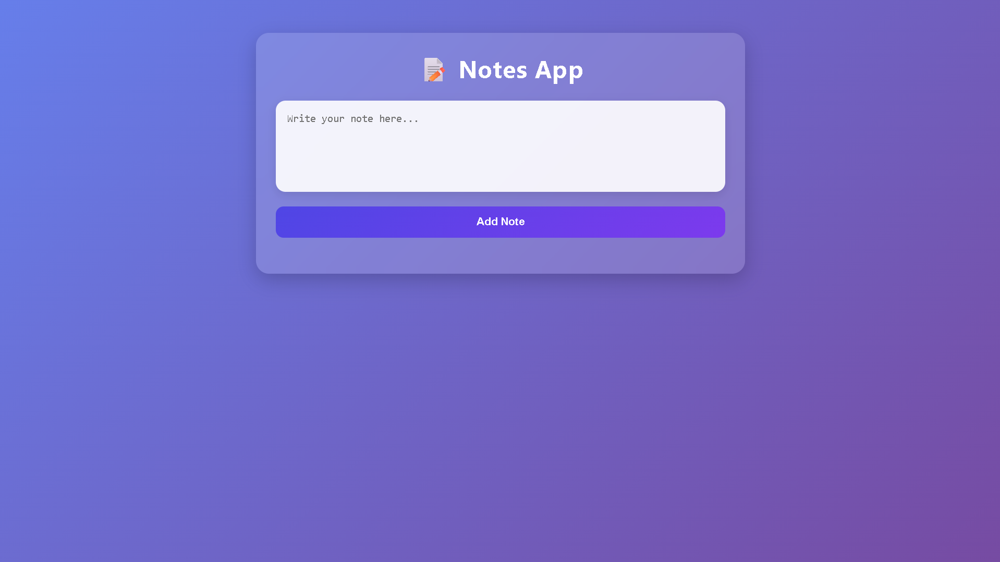

# 📝 Notes App

A simple and responsive Notes App built using HTML, CSS, and JavaScript.

This is my first GitHub project where users can write notes and manage them with a clean and modern interface.

---

## 🚀 Features

- Add new notes
- Delete notes
- Responsive design
- Clean and user-friendly UI
- Built with pure HTML, CSS, and JavaScript

---

## 🛠️ Technologies Used

- HTML5
- CSS3
- JavaScript (Vanilla JS)

---

## 📸 Screenshot



---

## 📂 Project Structure

```text
Notes-App/
│
├── index.html
├── style.css
├── script.js
├── assets/
│   └── screenshot.png
└── README.md
```

---

## 🎯 Future Improvements

- Edit Notes
- Dark Mode
- Search Notes
- Local Storage Support
- Pin Important Notes

---

## ▶️ How to Run

1. Download or clone the repository.
2. Open the project folder.
3. Run `index.html` in your browser.

---

## 👨‍💻 Author

**MD TALHA**

My first GitHub project 🚀

---

## ⭐ Support

If you like this project, don't forget to give it a star.